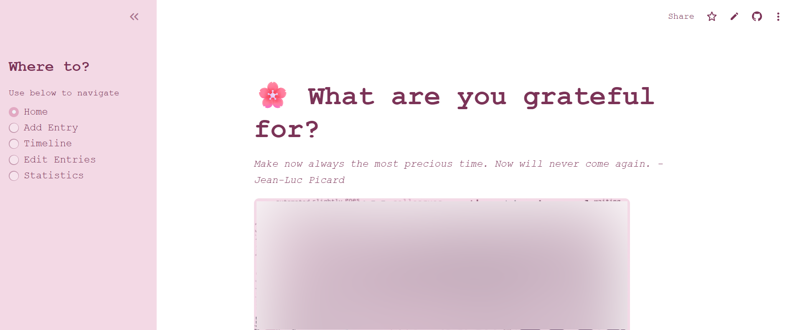
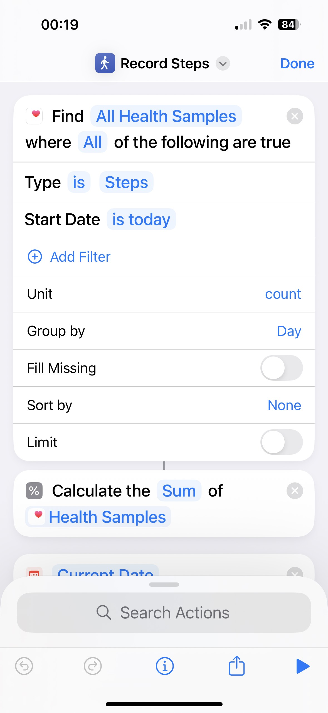
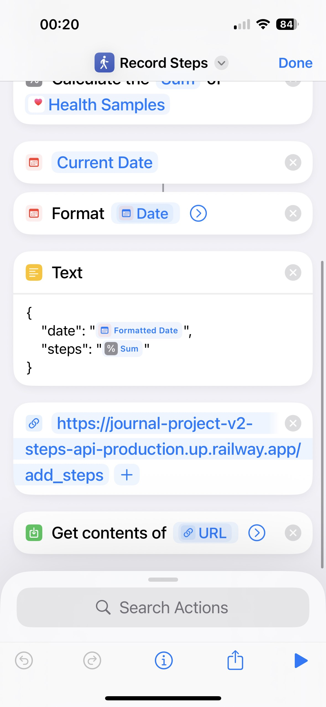

# journal-project-v2
Repository for a light-weight app to record a daily gratitude entry alongside other daily data.




## Contents
- [Overview](#overview)
- [Requirements](#requirements)
- [Directory Structure](#directory)
- [Installation](#installation)
  - [Step One: Install Dependencies](#step-one)
  - [Step Two: Configure Secrets](#step-two)
  - [Step Three: Set Up Supabase](#step-three)
  - [Step Four: Set Up Steps API (Optional)](#step-four)
- [Usage](#usage)
- [Customising the App](#customising-the-app)
- [Contributing](#contributing)
- [License](#license)


## 🌸 Overview
Author: Cheylea Hopkinson

The Gratitude Journal is a lightweight Streamlit app for recording daily gratitude entries, tracking mood and weather data, and visualising trends over time.

It integrates with:
- **[Supabase](https://supabase.com/)** for data and image storage
- **[OpenWeatherMap](https://openweathermap.org/)** for weather information
- **[Streamlit](https://streamlit.io/)** for an interactive front-end
- (Optional) **FastAPI + iOS Shortcuts** for automatic step tracking (deployed via Railway or similar)

## Requirements
To deploy your own version of this project you will need:
- A [Streamlit Account](https://share.streamlit.io/)
- A [Supabase Account](https://supabase.com/dashboard/signup)
- A [Railway Account](https://railway.com/login) (optional if want to keep steps, or use similar for deployment)

# Directory

```
C:.
├───.streamlit
│   ├───config.toml
│   └───secrets.toml
├───functions
│   ├───InitialiseJournal.py
│   ├───JournalFunctions.py
│   ├───SentimentFunctions.py
│   └───WeatherFunctions.py
├───.gitignore
├───app.py
├───LICENSE
├───README.md
├───requirements.txt
└───steps_api.py
```

# Installation

## Step One
Use the package manager [pip](https://pip.pypa.io/en/stable/) to install the dependencies.

```
python -m pip install -r requirements.txt
```

## Step Two
Create the file `secrets.toml` within the .streamlit folder in the repository.

Copy and paste into the below:

```python
app_password = "yourpassword"
WeatherAPIKey = "yourapikey"
LAT = "51.509865" # Example: London
LONG = "-0.118092" # Example: London
SUPABASE_URL = "https://yoururl.supabase.co"
SUPABASE_KEY = "yoursupabasekey"
```
Add your own keys into the strings to run the programme.

`app_password` can be set to anything you like to log in to your app.\
`WeatherAPIKey` can be obtained from [OpenWeatherMap](https://openweathermap.org/api) where you will need to sign up and generate your free key.\
`LAT` latitude coordinates for your location\
`LONG` latitude coordinates for your location

### Supabase
In order to use this app you will need to set up your own database using [Supabase](https://supabase.com/). Sign up to Supabase and create a new project, giving it a name, password and region.

Once the project is created, go to Settings / API to find:\
`SUPABASE_URL` - your project API URL\
`SUPABASE_KEY` - your public API key

## Step Three
Your app relies on Supabase for storing journal entries and uploaded images. Follow these steps:

1. Run the InitialiseJournal.sql file to create database tables.

2. Create a Storage bucket named journal-images.

3. Apply the required RLS policies (see Supabase setup guide for examples).

This gives your app a secure cloud database for text, metadata, and photos.

## Step Four
Setting up the Steps API.

If you want to incorporate automated steps for your journal entry, you can do this using Shortcuts and the Health app on an iPhone. There may be similar ways to set this up for Android but I have not tested this.

### Setting up via an iOS device
Clone the [Steps API](https://github.com/cheylea/journal-project-v2-steps-api) small repository that I have created. Use Railway or something similar to deploy this repository and create a live end point. More information [here](https://docs.railway.com/quick-start).

You can then create a shortcut on your iOS device with the following set up:



And finally set up an automation like so:


# Usage

## Running the App
When everything is set up, to use the app you will need to open a terminal and type in
```
streamlit run app.py
```

This will automatically launch your app in the browser.
If you want to deploy this app so you can access it anytime online without needing to run it on your local machine, you can deploy the app using the online [Streamlit website](https://docs.streamlit.io/deploy/streamlit-community-cloud/deploy-your-app).

There is also a button on the top right of the app for "deploy".

When deploying the app you will need to configure your secrets file within the online community cloud so that your app works. Go to Settings > Secrets and copy in from `secrets.toml`

## Customising the App
This app is built using the Front End Streamlit. As a result, it is quite easy to customise to your taste in a few different ways.

### Changing the config.toml
You can adjust the colours and theme by changing them in the `config.toml` file.

```toml
[theme]
primaryColor="#E2A9C2"
backgroundColor="#ffffff"
secondaryBackgroundColor="#F3D9E5"
textColor="#7B3357"
```

### Changing stylesheet within app.py
Within `app.py` there is a section for overriding some of the automatic stylesheet settings.

```python
# Custom theme adjustments
st.markdown("""
<style>
/* Apply font to all regular text elements, but NOT to icon fonts */
html, body, [data-testid="stAppViewContainer"], [data-testid="stMarkdownContainer"] * {
    font-family: 'Courier New', monospace !important;
}

/* Keep Streamlit Material Icons working */
[class^="material-icons"], [class*="material-icons"] {
    font-family: 'Material Icons' !important;
}
</style>
""", unsafe_allow_html=True)
```
You can edit within here to do things like override font styles, add your own custom background, etc.

### Editing the app
Of course new pages and renderings can be easily added by amending the main body of `app.py` code as well.

## Contributing
Pull requests aren't enabled for this repository, but you're welcome to **use, modify, and adapt** the code for your own projects.
If you create something inspired by this project, I’d love to see it!  
Feel free to share your version or ideas by opening a discussion or tagging me in your repo.

## License
This project is licensed under the terms of the [MIT License](LICENSE).